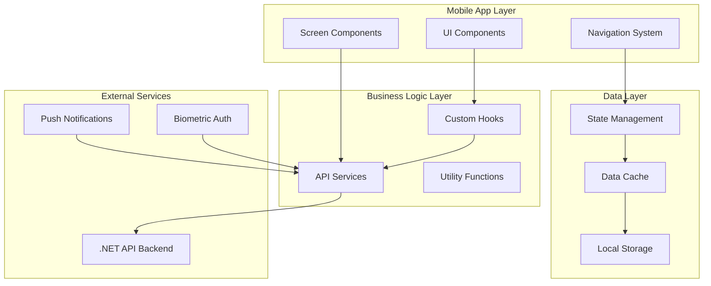

# Design Document

## Overview

The Recur mobile application will be built using React Native with Expo, providing a native mobile experience that mirrors the functionality of the existing web application. The app will utilize the existing .NET API backend, implementing a clean architecture with proper separation of concerns, offline capabilities, and platform-specific optimizations for both iOS and Android.

The design follows modern mobile development patterns with TypeScript for type safety, React Query for efficient data management, and Zustand for lightweight state management. The app will implement a tab-based navigation structure with smooth animations and responsive design principles.

## Architecture

### High-Level Architecture



### Technology Stack

- **Framework**: React Native with Expo SDK 53
- **Language**: TypeScript for type safety
- **Navigation**: Expo Router with file-based routing
- **State Management**: Zustand for global state, React Query for server state
- **Data Fetching**: Axios with React Query for caching and synchronization
- **Local Storage**: Expo SecureStore for sensitive data, AsyncStorage for general data
- **Authentication**: JWT tokens with biometric authentication support
- **UI Components**: Custom components with platform-specific styling
- **Charts**: Victory Native for analytics visualization
- **Offline Support**: React Query with background sync
- **Push Notifications**: Expo Notifications

### Project Structure

```
src/
├── components/           # Reusable UI components
│   ├── common/          # Generic components (Button, Input, etc.)
│   ├── forms/           # Form-specific components
│   ├── charts/          # Chart components
│   └── lists/           # List and card components
├── screens/             # Screen components
│   ├── auth/            # Authentication screens
│   ├── dashboard/       # Dashboard and analytics
│   ├── subscriptions/   # Subscription management
│   ├── categories/      # Category management
│   └── profile/         # Profile and settings
├── services/            # API and external services
│   ├── api/             # API client and endpoints
│   ├── auth/            # Authentication service
│   ├── storage/         # Local storage service
│   └── notifications/   # Push notification service
├── hooks/               # Custom React hooks
├── store/               # Zustand stores
├── types/               # TypeScript type definitions
├── utils/               # Utility functions
├── constants/           # App constants and configuration
└── assets/              # Images, fonts, and static assets
```

## Components and Interfaces

### Core Components

#### Authentication Components

**LoginScreen**
- Email/password input fields with validation
- Biometric authentication option (after initial setup)
- "Remember me" functionality
- Error handling and loading states
- Platform-specific keyboard handling

**BiometricSetup**
- Biometric availability detection
- Setup flow for fingerprint/face recognition
- Fallback to password authentication
- Security warnings and user education

#### Dashboard Components

**DashboardScreen**
- Stats overview cards (total cost, active subscriptions, etc.)
- Quick action buttons (add subscription, view all)
- Upcoming bills section
- Trial ending alerts
- Pull-to-refresh functionality

**StatsCard**
- Animated number displays
- Currency conversion indicators
- Trend indicators (up/down arrows)
- Tap-to-expand functionality

**ChartComponents**
- Monthly spending line chart
- Category spending pie chart
- Interactive chart elements
- Loading skeletons

#### Subscription Management Components

**SubscriptionList**
- Virtualized list for performance
- Search and filter functionality
- Swipe actions (edit, cancel, delete)
- Category color indicators
- Empty state handling

**SubscriptionCard**
- Subscription details display
- Status indicators (active, trial, cancelled)
- Next billing date countdown
- Currency conversion display
- Quick action buttons

**SubscriptionForm**
- Multi-step form for creation/editing
- Category selection with color preview
- Date picker for billing dates
- Currency selection
- Form validation and error handling

#### Category Management Components

**CategoryList**
- Grid or list view toggle
- Color-coded category cards
- Subscription count per category
- Add/edit/delete actions

**CategoryForm**
- Name and description inputs
- Color picker component
- Preview of category appearance
- Validation for duplicate names

#### Profile and Settings Components

**ProfileScreen**
- User information display and editing
- Settings sections (notifications, currency, etc.)
- Account management options
- Data export functionality

**SettingsForm**
- Grouped settings sections
- Toggle switches for notifications
- Currency selection dropdown
- Theme selection (if implemented)
- Budget limit input

### API Service Layer

#### AuthService
```typescript
interface AuthService {
  login(credentials: LoginCredentials): Promise<AuthResponse>
  logout(): Promise<void>
  refreshToken(): Promise<string>
  getCurrentUser(): Promise<User>
  updateProfile(profile: UpdateProfileDto): Promise<User>
  changePassword(passwords: ChangePasswordDto): Promise<void>
  setupBiometric(): Promise<boolean>
  authenticateWithBiometric(): Promise<string>
}
```

#### SubscriptionService
```typescript
interface SubscriptionService {
  getSubscriptions(filters?: SubscriptionFilters): Promise<Subscription[]>
  getSubscription(id: number): Promise<Subscription>
  createSubscription(data: CreateSubscriptionDto): Promise<Subscription>
  updateSubscription(id: number, data: UpdateSubscriptionDto): Promise<void>
  deleteSubscription(id: number): Promise<void>
  cancelSubscription(id: number): Promise<void>
  reactivateSubscription(id: number): Promise<void>
  getSubscriptionHistory(id: number): Promise<SubscriptionHistory[]>
}
```

#### DashboardService
```typescript
interface DashboardService {
  getDashboardStats(currency?: string): Promise<DashboardStats>
  getNotifications(): Promise<Notification[]>
  getMonthlySpending(currency?: string): Promise<MonthlySpending[]>
  getCategorySpending(currency?: string): Promise<CategorySpending[]>
  getUpcomingBills(currency?: string): Promise<UpcomingBill[]>
  getRecentActivity(currency?: string): Promise<RecentActivity[]>
  getAnalyticsOverview(timeRange: string, currency?: string): Promise<AnalyticsOverview>
}
```

### State Management

#### Authentication Store
```typescript
interface AuthStore {
  user: User | null
  token: string | null
  isAuthenticated: boolean
  isLoading: boolean
  login: (credentials: LoginCredentials) => Promise<void>
  logout: () => Promise<void>
  updateUser: (user: User) => void
  checkAuthStatus: () => Promise<void>
}
```

#### App Settings Store
```typescript
interface AppSettingsStore {
  currency: string
  theme: 'light' | 'dark' | 'system'
  notifications: NotificationSettings
  biometricEnabled: boolean
  offlineMode: boolean
  setCurrency: (currency: string) => void
  setTheme: (theme: string) => void
  updateNotificationSettings: (settings: NotificationSettings) => void
  toggleBiometric: (enabled: boolean) => void
}
```

## Data Models

### Core Types

```typescript
interface User {
  id: string
  email: string
  firstName?: string
  lastName?: string
  timeZone?: string
  currency: string
  budgetLimit?: number
  createdAt: Date
  lastLoginAt?: Date
  roles: string[]
}

interface Subscription {
  id: number
  name: string
  description?: string
  cost: number
  currency: string
  billingCycle: BillingCycle
  billingCycleText: string
  nextBillingDate: Date
  trialEndDate?: Date
  cancellationDate?: Date
  website?: string
  contactEmail?: string
  notes?: string
  isActive: boolean
  isTrial: boolean
  daysUntilNextBilling: number
  createdAt: Date
  updatedAt: Date
  category: Category
  convertedCost?: number
  convertedCurrency?: string
  exchangeRate?: number
  rateTimestamp?: Date
  isConverted: boolean
  isRateStale: boolean
}

interface Category {
  id: number
  name: string
  description?: string
  color: string
  isDefault: boolean
  createdAt: Date
}

interface DashboardStats {
  totalSubscriptions: number
  activeSubscriptions: number
  totalMonthlyCost: number
  totalAnnualCost: number
  upcomingBills: number
  trialEnding: number
  daysUntilNextBilling: number
  displayCurrency: string
  currencyBreakdowns: CurrencyBreakdown[]
}

enum BillingCycle {
  Weekly = 1,
  Monthly = 2,
  Quarterly = 3,
  SemiAnnually = 4,
  Annually = 5,
  Biannually = 6
}
```

## Error Handling

### Error Types and Handling Strategy

#### Network Errors
- Connection timeout handling
- Retry mechanisms with exponential backoff
- Offline mode activation
- User-friendly error messages

#### Authentication Errors
- Token expiration handling
- Automatic token refresh
- Biometric authentication fallback
- Secure logout on critical errors

#### Validation Errors
- Real-time form validation
- Server-side validation error display
- Field-specific error messages
- Accessibility-compliant error announcements

#### API Errors
- HTTP status code handling
- Server error message parsing
- Fallback error messages
- Error logging for debugging

### Error Boundary Implementation
```typescript
interface ErrorBoundaryState {
  hasError: boolean
  error?: Error
  errorInfo?: ErrorInfo
}

class AppErrorBoundary extends Component<Props, ErrorBoundaryState> {
  // Error boundary implementation with crash reporting
  // Graceful fallback UI
  // Error recovery mechanisms
}
```

## Testing Strategy

### Unit Testing
- Component testing with React Native Testing Library
- Service layer testing with Jest
- Hook testing with custom test utilities
- Utility function testing

### Integration Testing
- API integration testing
- Authentication flow testing
- Data synchronization testing
- Offline/online mode testing

### End-to-End Testing
- Critical user journey testing
- Cross-platform testing (iOS/Android)
- Performance testing
- Accessibility testing

### Testing Tools
- Jest for unit testing
- React Native Testing Library for component testing
- Detox for E2E testing
- Flipper for debugging and performance monitoring

## Performance Optimizations

### List Virtualization
- FlatList with optimized rendering
- Item height estimation
- Lazy loading for large datasets
- Memory management for scroll performance

### Image Optimization
- Expo Image for optimized image loading
- Lazy loading for images
- Proper image sizing and caching
- WebP format support where available

### Data Caching
- React Query for intelligent caching
- Background data synchronization
- Stale-while-revalidate strategy
- Cache invalidation strategies

### Bundle Optimization
- Code splitting where applicable
- Tree shaking for unused code
- Asset optimization
- Bundle analysis and monitoring

### Memory Management
- Proper cleanup in useEffect hooks
- Subscription cleanup
- Image cache management
- Navigation state cleanup

## Security Considerations

### Authentication Security
- JWT token secure storage using Expo SecureStore
- Token expiration handling
- Biometric authentication integration
- Session management

### Data Protection
- Sensitive data encryption at rest
- Secure API communication (HTTPS)
- Certificate pinning for API calls
- Input sanitization and validation

### Privacy Compliance
- User data handling transparency
- Opt-in for data collection
- Data export functionality
- Account deletion capabilities

### Platform Security
- iOS Keychain integration
- Android Keystore integration
- App Transport Security compliance
- Code obfuscation for production builds